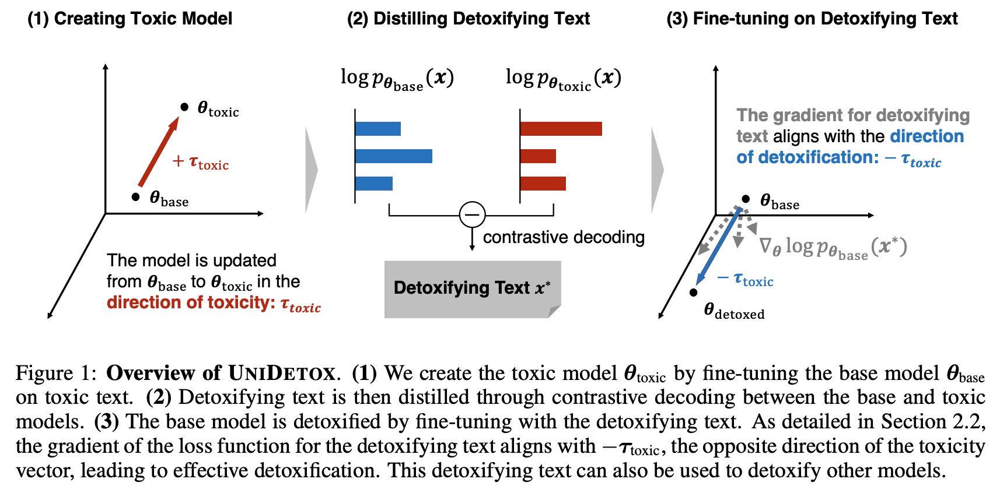

# UniDetox

Codes for [UniDetox: Universal Detoxification of Large Language Models via Dataset Distillation](https://openreview.net/forum?id=eLLBILFRsA).

**Authors**:  
Huimin Lu<sup>1</sup>, Masaru Isonuma<sup>1,2,3</sup>, Junichiro Mori<sup>1,4</sup>, and Ichiro Sakata<sup>1</sup>  

<sup>1</sup>University of Tokyo  
<sup>2</sup>University of Edinburgh  
<sup>3</sup>National Institute of Informatics (NII)  
<sup>4</sup>RIKEN AIP  

<p align="center">
  
</p>

---

## 0. Reproduce the Environment

```bash
conda env create --name unidetox -f environment.yml
conda activate unidetox
```

### Potential GLIBCXX Issue
On some Linux systems, you may encounter an error about GLIBCXX_3.4.29 not found. 

This happens if your system’s library paths overshadow conda’s newer libstdc++.so.6. 

To ensure the conda environment’s libraries take priority, you can do:

```bash
export LD_LIBRARY_PATH="$CONDA_PREFIX/lib:$LD_LIBRARY_PATH"
```

## 1. Obtain a Toxic Model and Distill Detoxifying Data
```bash
python -m unidetox.toxic_gpt2_finetune_and_distill \
  --base_model_name gpt2-xl \
  --output_dir ./toxic_model \
  --auth_token "enter_your_huggingface_auth_token_here_to_load_DGHS_dataset" \
  --epochs 3 \
  --lr 1e-5 \
  --batch_size 4
```

  ## 2. Fine-tune Model(s) for Detoxification

```bash
  python -m unidetox.unidetox --mode finetune \
  --mode finetune \
  --auth_token "enter_your_huggingface_auth_token_here_to_use_LLaMA2" \
  --target_model "gpt2-xl"
```

  ## 3. Reproduce our Evaluation Results of GPT-2 XL

```bash
  python -m unidetox.unidetox --mode evaluate \
  --mode evaluate \
  --auth_token "enter_your_huggingface_auth_token_here_to_use_LLaMA2" \
  --target_model "gpt2-xl"
```

If you find our work helpful, please cite our paper:

```bibtext
@inproceedings{
lu2025unidetox,
title={UniDetox: Universal Detoxification of Large Language Models via Dataset Distillation},
author={Huimin LU and Masaru Isonuma and Junichiro Mori and Ichiro Sakata},
booktitle={The Thirteenth International Conference on Learning Representations},
year={2025},
url={https://openreview.net/forum?id=eLLBILFRsA}
}
```
